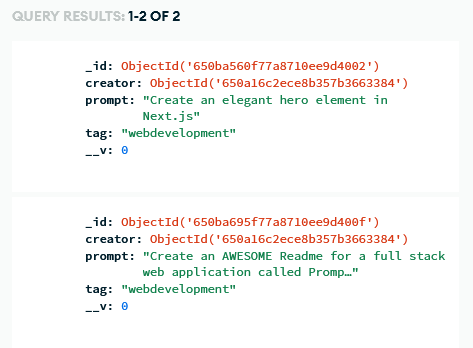

# Promptopia

Want a place to write down your ideas for AI prompts and share them with others? Promptopia is the place for you!

Check out the deployed site [here](https://promptopia-joshuatoback.vercel.app/)!

## How Does It Work?

Once you load up the page, you are greeted by prompts shared by users with tags.

First, sign in via Google Authenticate.

Once you're signed in you can create your first prompt! 

Creating your first prompt is easy. Simply click the "Create Post" button and you'll be redirected to a page where you can write up your prompt and an associated hashtag! 

Then, once you hit Create, you'll see your prompt on the feed! 

Want to review your submissions? You can do so via your profile! Just click the icon on the top right.

Don't like what you see? That's fine! You can edit your prompts and tags as you see fit, and even delete them from the database on your profile! 

Once your prompts are saved, they are stored inside of our MongoDB Atlas Database! 

## Technolgies Used

- React.jsx
- Next.js 13 
- MongoDB
- Google Cloud
- Tailwind CSS
- BCrypt

## Contact Me

Feel free to reach out and discuss this site with me via email:

joshuatobackdev@gmail.com
